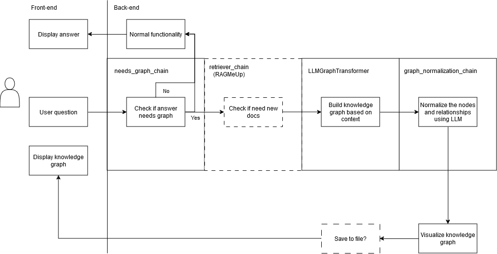

# RAGMeUp with GraphRag

In our project we extended the use of **RAGMeUp** to include entity-relationship knowledge graphs from the corpus. We have imlemented the class GraphRAG as our primary mission was to add the capability of automatically creating and visualizing knowledge graphs based on the question asked. Below you can find the proposed solution. 

# Langchains
We make use of two particular LLM chains in this process:

needs_graph_chain: Determines whether or not the user asked/needs a knowledge graphs based on the question.

graph_normalization_chain: Tries to normalize the nodes and relationships in the knowledge graph for a cleaner output and to increase the connectivity of the knowledge graph.

# Experiment Set-up 
We have ran our experiement set up in Google Collab and used "Ollame-3.1-8B Instruct" model with Ngrok. This was the proposed experimentation set-up in the assignment. We have came across couple problems while testing. First a commit made during the development by the owner of the repository did took us back and made us spend time debugging. Then Ollama model started giving errors and refused connections. Now without a test enviroment our development has nearly came to a halt as we couldn't see our results and/or errors. 

# RAGMeUp Integration
In order to fully incorporate our idea on the RagMeUp framework the frontend needs to be able to display a graph. In our eyes the backend simply generates a graph, exports it to a file (.png) and uses that file to visualize it on the frontend. The backend integration has been done partially but was discontinued due to not being able to test on the server. We did however simulate the data formats (inputs/outputs) used in the RAGMeUp repository to make integration easy. The notebook contains a class which contains all functionality needed for generating knowledge graphs based on the context.

# Future work
For future work we would like to improve the graph visualization. Currently it is quite rudimentary and we see lots of possibilities to make the graphs cleaner and even make them interactive. Furthermore, the prompt for normalization of the relationships could use some improvement to further clean up the nodes and relationships. Lastly, we would like add filtered relationships in where the model is restricted in adding relationships, currently the model has free reign to add whatever node or relationship it likes which sometimes leads to it making very specific nodes or relationships that do not add much value.